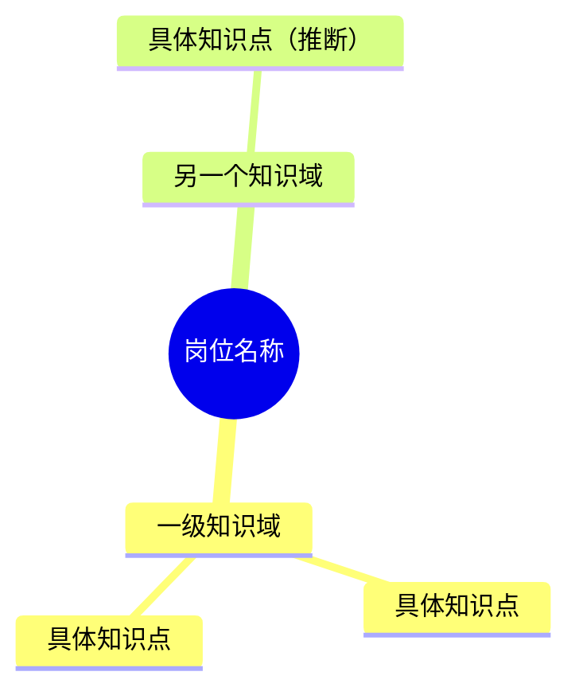

# JD Knowledge Map

将招聘岗位描述（JD）转成可学习、可复习的知识结构。忠于原文，并把原文明确要求与合理补充的前置知识区分开。

## 获取输入

- 优先使用用户提供的完整 JD；输入可以是文本、截图、图片、可访问的文件或链接。
- 输入包含图片时，先完整解析图片中的 JD，再提炼知识点：
  1. 查看原图或尽可能高分辨率的版本，结合视觉阅读与可用的 OCR 提取文字。
  2. 按标题、栏目和项目符号恢复版面结构，区分岗位职责、任职要求、加分项及其他信息；不要把应用界面、广告或状态栏文字混入 JD。
  3. 多张截图按页码、连续内容和视觉顺序拼接，去除截图之间的重叠段落，但不要遗漏跨图衔接的条目。
  4. 校对岗位名、技术名、大小写、数字和否定词。模糊内容标为无法辨认，不根据上下文擅自补字。
  5. 若关键内容模糊、被裁切或图片顺序无法判断，先请用户提供更清晰或完整的图片；非关键的少量缺失不影响分析时可以继续，并在“范围与假设”中说明。
- 将图片解析结果作为后续分析的 JD 正文；除非用户要求，不必额外输出完整转录文本。
- 若没有足够的岗位描述，先请用户粘贴或提供 JD，不凭岗位名称臆造要求。
- 沿用用户的语言；中英文混合术语保留业界常用写法。

## 提炼知识点

1. 识别岗位名称、职级、核心职责、必备条件、加分项、业务领域和交付场景。
2. 将职责和要求拆成原子知识点，合并同义项，保留关键技术名、协议、平台和方法论。
3. 将年限、学历、地点、薪酬等招聘条件排除出知识图；只有在它们指向明确能力时才转写成能力节点。
4. 为完成职责所必需但 JD 未明说的基础知识可以补充，节点末尾标记 `（推断）`。不要虚构版本号、认证、工具或业务约束。
5. 根据 JD 的叙述顺序和岗位相关性安排知识点：核心职责直接要求的内容在前，加分项和推断内容在后。不要添加优先级、重要度、星级或阶段标签。

## 组织大纲图

- 以岗位名称为根节点，按 JD 内容动态选择一级主题，不强行套用空分类。
- 优先考虑业务与领域、计算机基础、语言与框架、数据与存储、架构与系统设计、工程效能、质量与安全、协作与交付等主题。
- 一级主题表示知识域，二级节点表示能力模块，叶子节点表示可学习或可检验的具体知识点。
- 将“熟悉某技术”展开为与岗位职责相关的核心机制和典型应用；所有超出原文的展开均标记为推断。
- 控制重复和粒度：同一知识点只放在最相关分支；避免同时出现过宽的口号和过碎的 API 名单。
- 若 JD 同时包含多个明显不同的岗位方向，分别生成大纲图，不把它们混成一个角色。

## 输出

默认依次输出：

1. 一句岗位画像，概括岗位目标和主要技术场景。
2. 一张 Mermaid `mindmap` 图；知识节点不带优先级或等级标签，推断节点带 `（推断）`。
3. “范围与假设”，只列信息缺口、歧义和关键推断；没有则省略。

使用下面的结构，不照抄占位内容：

确保 Mermaid 缩进表达父子关系，节点文本简短，图中不放长句、依据说明、招聘条件或任何形式的等级标记。用户指定 Markdown 层级列表、思维导图文本或其他格式时，保留同样的层级和推断标记，但改用用户要求的格式。
